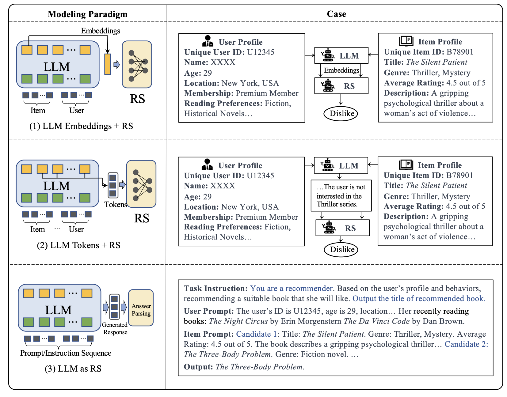
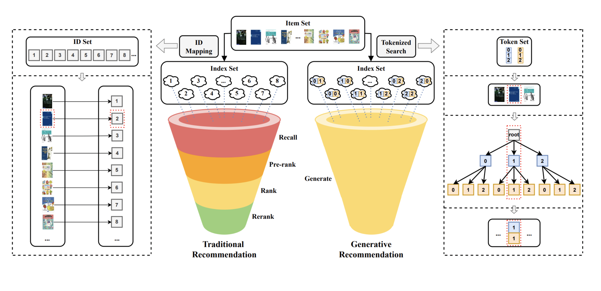

# Awesome generative recommendation using large language models (LLMs)

## Introduction
Generative recommendation using large language models (LLMs) is a new paradigm in recommendation systems. LLMs are pre-trained models that can generate text and are capable of understanding and generating human language. They have been shown to be effective in a variety of natural language processing tasks, such as language modeling, translation, and summarization. In the context of recommendation systems, LLMs can be used to generate personalized recommendations by taking into account user preferences, item features, and contextual information. This new approach to recommendation systems has the potential to improve the quality of recommendations and provide more personalized and engaging user experiences.

This repository contains a collection of papers, blog posts, and tutorials on generative recommendation using large language models. It aims to provide an overview of the current state of the art in this area and to highlight the potential of LLMs for recommendation systems.

Source: [A Survey on Large Language Models for Recommendation](https://arxiv.org/pdf/2305.19860.pdf)

## Papers

Uncovering ChatGPT's Capabilities in Recommender Systems. [paper](https://arxiv.org/pdf/2305.02182.pdf) | [code](https://github.com/rainym00d/LLM4RS)

A Survey on Large Language Models for Recommendation [paper](https://arxiv.org/pdf/2305.19860.pdf)

Do LLMs Understand User Preferences? Evaluating LLMs On User Rating Prediction ｜ [paper](https://arxiv.org/pdf/2305.06474.pdf)

Recommendation as Instruction Following: A Large Language Model Empowered Recommendation Approach | [paper](https://arxiv.org/abs/2305.07001)

PALR: Personalization Aware LLMs for Recommendation [paper](https://arxiv.org/abs/2305.07622)

LLM-Rec: Personalized Recommendation via Prompting Large Language Models | [paper](https://arxiv.org/abs/2307.15780)

Recommender Systems in the Era of Large Language Models (LLMs) | [paper](https://arxiv.org/abs/2307.02046)

RecMind: Large Language Model Powered Agent For Recommendation | [paper](https://arxiv.org/abs/2308.14296)

Adapting Large Language Models by Integrating Collaborative Semantics for Recommendation | [paper](https://arxiv.org/abs/2311.09049)

LLM-Based Aspect Augmentations for Recommendation Systems | [paper](https://openreview.net/pdf?id=bStpLVqv1H)

Unlocking the Potential of Large Language Models for Explainable Recommendations | [paper](https://arxiv.org/abs/2312.15661)

## Blog Posts

Recommendation Systems using Langchain and LLMs with codes [blog](https://medium.com/data-science-in-your-pocket/recommendation-systems-using-langchain-and-llms-with-codes-d3c4c4e66732)

https://blog.tensorflow.org/2023/06/augmenting-recommendation-systems-with.html | [blog](https://blog.tensorflow.org/2023/06/augmenting-recommendation-systems-with.html)

## Tutorial

RecSys 2023 Tutorial:Large Language Models for Recommendation | [web](https://llmrecsys.github.io/)
